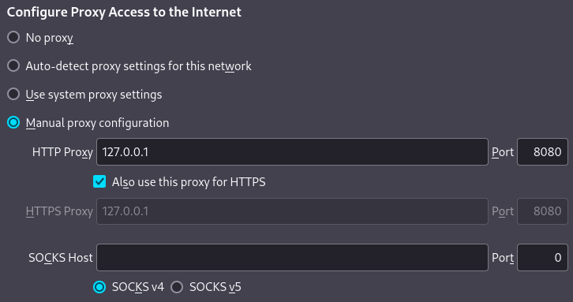
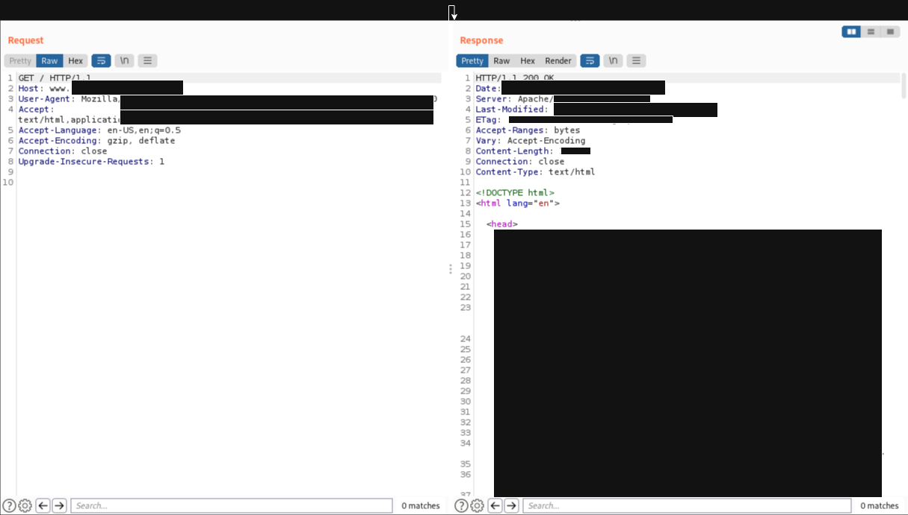
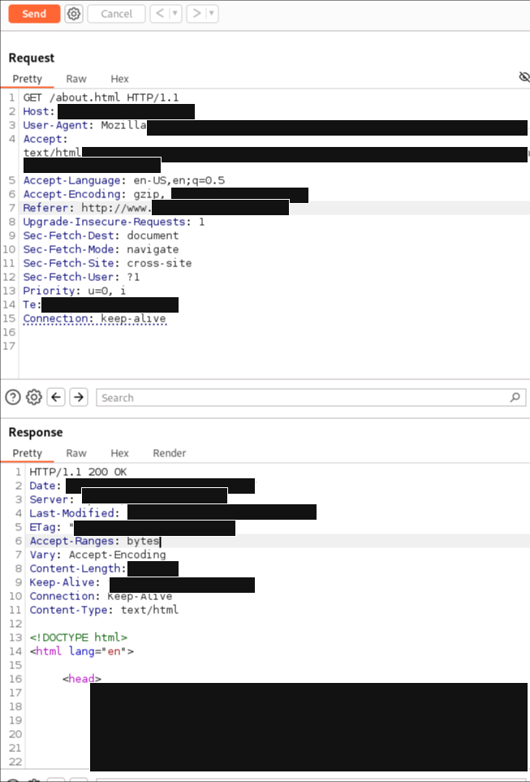
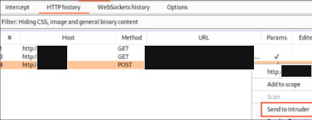
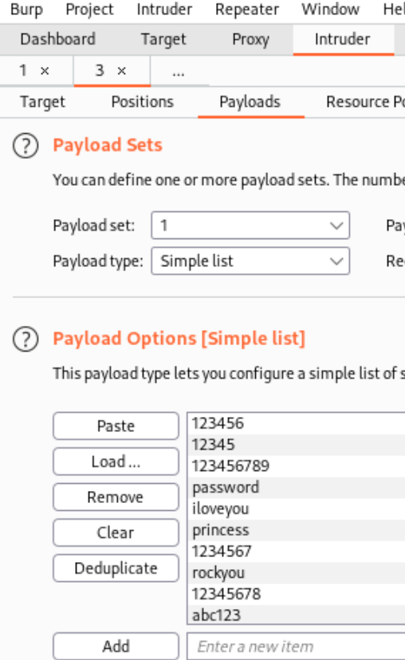
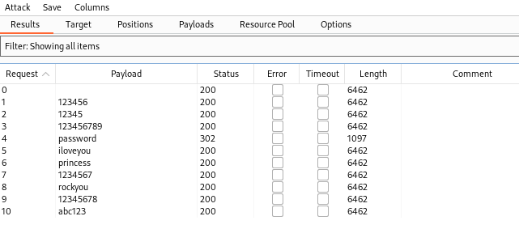
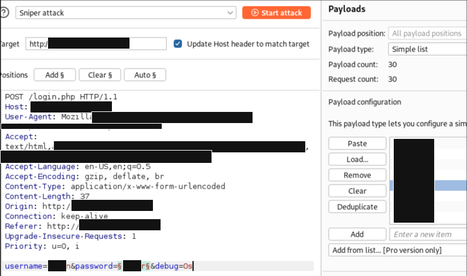
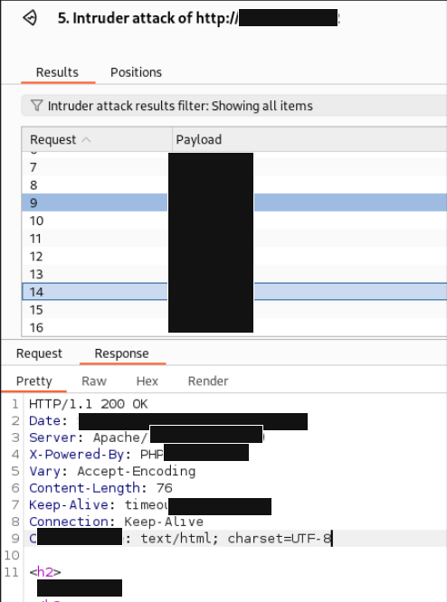

# Burp Suite

Burp Suite = GUI-based web application security testing platform.
- intercept HTTP/HTTPS traffic
- inspect requests and responses
- modify parameters
- replay requests
- test authentication/session logic
- map application endpoints
- send requests to Repeater / Intruder

Burp acts as a local web proxy between browser and target.
```text
Firefox -> Burp proxy -> target web server
```

With intercept enabled:
```
Firefox request  -> Burp catches request  -> edit / forward / drop  -> target receives modified request
```

Useful for:
- seeing hidden parameters
- modifying POST data
- testing cookies
- changing headers
- replaying requests
- checking how the app handles input

---

## Quick Exam Workflow

```
configure Firefox proxy  
	-> import Burp cert  
	-> set target scope  
	-> browse manually  
	-> review HTTP history  
	-> send interesting requests to Repeater  
	-> test one input at a time  
	-> document endpoint + parameter + behavior
```

| Tab          | Use                           |
| ------------ | ----------------------------- |
| Proxy        | Capture and inspect traffic   |
| HTTP History | Review requests and responses |
| Repeater     | Modify and replay requests    |
| Intruder     | Controlled parameter fuzzing  |
| Site map     | Application structure review  |


---

## Proxy Concept

A web proxy sits between client and server.

```
client browser -> proxy -> web server
```

Burp proxy:
- listens locally, usually on `127.0.0.1:8080`
- receives browser traffic
- shows HTTP/HTTPS requests
- lets you intercept and modify traffic
- forwards requests to the target

Corporate / enterprise proxies may also inspect TLS traffic by decrypting and re-encrypting HTTPS traffic. Burp does the same locally for testing, but only after the Burp CA certificate is trusted by the browser.

---

## Firefox + Burp Setup

### 1. Start Burp

Open Burp Suite and check proxy listener:

```
Proxy -> Proxy settings -> Proxy listeners
```

Default listener:

```
127.0.0.1:8080
```

### 2. Configure Firefox Proxy

Firefox path:
```
about:preferences#general
```

Then:
```
Network Settings -> Settings -> Manual proxy configuration
```

Set:
```
HTTP Proxy: 127.0.0.1  
Port: 8080  
  
HTTPS Proxy: 127.0.0.1  
Port: 8080
```

Enable:
```
Also use this proxy for HTTPS
```

Optional:
```
No proxy for: localhost, 127.0.0.1
```



---

## Import Burp CA Certificate

Needed for HTTPS interception.

### 1. Visit Burp certificate page

With Burp running and Firefox proxy enabled, browse to:
```
http://burp/
```

Download the CA certificate.

Usually named:
```
cacert.der
```

### 2. Import into Firefox

Firefox path:
```
about:preferences
```

Search:
```
certificates
```

Then:
```
View Certificates -> Authorities -> Import
```

Select Burp certificate and enable:
```
Trust this CA to identify websites
```

Now HTTPS sites should load through Burp without certificate errors.

---

## Intercept Traffic

Enable intercept:
```
Proxy -> Intercept -> Intercept is on
```

Then visit the target in Firefox.

Burp should show requests such as:
```HTTP
GET / HTTP/1.1
Host: target_ip
User-Agent: Mozilla/5.0
Cookie: session=session_value
```

Actions:
- `Forward` -> send request to server
- `Drop` -> discard request
- edit values before forwarding
- right-click -> send to Repeater




---

## Repeater Workflow

Repeater = manually edit and replay requests.

Typical workflow:

```
Proxy HTTP history
  -> right-click interesting request
  -> Send to Repeater
  -> modify one value
  -> Send
  -> compare response
```

Good for testing:
- SQLi
- command injection
- LFI/path traversal
- IDOR
- auth bypass
- header manipulation
- cookie tampering
- upload behavior

Example:
```HTTP
GET /product?id=1 HTTP/1.1
Host: target_ip
```

Change:
```HTTP
GET /product?id=2 HTTP/1.1
Host: target_ip
```

Check:
- response status
- response length
- visible data changes
- errors
- access control behavior

click send --> show Response



---

## Intruder Workflow

Sniper attack = one payload position, one payload list.  
  
Good for:  
- testing one parameter at a time  
- password guessing for a known username  
- fuzzing one input field  
- testing one cookie value  
- checking one numeric ID  
- small focused payload sets


e.g.  WP Login Brute-Force / Password Guessing w/ Burp Intruder

1. Browse to `/wp-login.php`
2. Try `admin:test`
3. Capture `POST /wp-login.php` in Burp
4. Right-click request → `Send to Intruder`


5. Go to `Positions`
6. Clear auto-selected positions
7. Select only password value
8. Add payload markers around it `log=admin&pwd=§test§&wp-submit=Log+In`
9. Go to `Payloads`
10. Set payload type = `Simple list`
11. Paste/load password wordlist

```bash
└─$ cat /usr/share/wordlists/rockyou.txt | head      
123456
12345
123456789
password
iloveyou
princess
1234567
rockyou
12345678
abc123
```




12. Start attack
13. Sort results by length/status/redirect/cookie

Attack Result: 10 requests made in attack

--> status code 302 :D --> try login 

Look for:
```
302 redirect to /wp-admin/  
wordpress_logged_in cookie  
different response length  
missing login error msg  
dashboard content
```

e.g. sniper attack - Password Guessing with `passwords.txt`
Use when you have a known username and want to test a short list of likely passwords.

```http
POST /login HTTP/1.1  
Host: target_ip  
Content-Type: application/x-www-form-urlencoded  
Cookie: session=session_value  
  
username=alice&password=password
```

mark only pw value
```http
username=alice&password=§password§
```




|Indicator|Meaning|
|---|---|
|Different status code|possible valid login|
|Different response length|possible valid login|
|Different redirect|possible valid login|
|Different error message|possible valid login|
|`302` to dashboard/admin|strong success indicator|
|session cookie changes|possible successful auth|

Example result pattern:
```
Payload        Status    Length    Notes
password       200       1832      invalid login
Password123    200       1832      invalid login
Summer2024     302       412       redirect to /dashboard
admin123       200       1832      invalid login
```

Possible finding:
```
username: alice
password: alice_password
result: 302 redirect to /dashboard
next step: verify manually in browser
```

e.g. report notes

|Item|Notes|
|---|---|
|Endpoint|`/login`|
|Method|POST|
|Username|alice|
|Payload list|`passwords.txt`|
|Attack type|Sniper|
|Success indicator|302 redirect / different length / dashboard access|
|Valid credential|alice:password|
|Manual verification|yes/no|
|Next action|enumerate authenticated app|


---

## HTTP History

Use HTTP history to map the app.

Location:
```
Proxy -> HTTP history
```

Track:
- endpoints
- methods
- parameters
- cookies
- redirects
- API calls
- upload/download requests
- admin paths
- interesting status codes

Useful filters:
- hide images/CSS/JS noise
- show only in-scope items
- sort by status code
- sort by MIME type
- search for keywords

Good keywords:

```
admin
login
upload
download
api
debug
error
token
session
user
role
id
```

---

## Scope

Set scope to avoid noise.
```
Target -> Site map -> right-click target -> Add to scope
```

Then in HTTP history:
```
Filter -> Show only in-scope items
```

Good habit:
- add only exam/lab targets to scope
- avoid capturing unrelated browser traffic
- use a dedicated Firefox profile for Burp

---

## Captive Portal Noise

If this appears in Burp history:
```
detectportal.firefox.com
```

It is Firefox checking for captive portals / Wi-Fi login pages.

To disable:
```
about:config
```

Search:
```
network.captive-portal-service.enabled
```

Set to:
```
false
```

This reduces proxy history noise.

---

## Common Burp Checks

### Check GET parameters
```http
GET /search?q=test HTTP/1.1
Host: target_ip
```

Try:
- change value
- add quotes
- test IDOR
- test path traversal
- test command separators if context suggests it

### Check POST forms

```http
POST /login HTTP/1.1
Host: target_ip
Content-Type: application/x-www-form-urlencoded

username=admin&password=password
```

Try:
- username variations
- password variations
- auth bypass checks
- role/status fields
- hidden fields

### Check cookies

```
Cookie: session=session_value; role=user; user_id=1
```

Try:
- change `user_id`
- change `role`
- check unsigned values
- compare behavior

### Check headers

Interesting headers:
```http
X-Forwarded-For: 127.0.0.1
X-Real-IP: 127.0.0.1
X-User-ID: 1
X-Role: admin
Referer: http://target_ip/
User-Agent: oscp123
```

Useful for:
- access control tests
- admin bypass attempts
- logging/reflection checks
- backend trust issues

## Upload Testing with Burp

Use Burp to inspect multipart uploads.

Look for:
```
Content-Disposition: form-data; name="file"; filename="test.php"Content-Type: application/x-php
```

Test:
- filename
- extension
- MIME type
- file content
- upload path
- whether file is executable
- whether file is only stored

Common test filenames:
```
test.txt
test.php
test.php.jpg
test.phtml
test.aspx
test.asp
```

## Useful Burp Tools

|Tool|Use|
|---|---|
|Proxy|intercept + HTTP history|
|Repeater|manual request testing|
|Intruder|small focused fuzzing|
|Decoder|encode/decode payloads|
|Comparer|compare responses|
|Target|site map + scope|
|Logger|request/response tracking|

---

## Intruder Note

Use Intruder carefully.

Good for:
- small parameter fuzzing
- short wordlists
- testing IDs
- testing usernames
- checking small payload sets

Avoid:
- huge brute force
- noisy scans
- wasting time when Repeater is enough

Pentest:
- Repeater first
- Intruder only for focused testing


---

## Troubleshooting

### Browser does not load anything

Check:
- Burp is running
- proxy listener is `127.0.0.1:8080`
- Firefox proxy points to `127.0.0.1:8080`
- Intercept is not holding requests unexpectedly
- target is reachable without proxy

---

### HTTPS certificate errors

Fix:
- visit `http://burp/`
- download certificate
- import into Firefox Authorities
- trust for website identification

---

### Requests stuck

Check:
```
Proxy -> Intercept
```

If intercept is on, click:
```
Forward
```

or temporarily set:
```
Intercept is off
```

---

### Too much noise in history

Fix:
- set target scope
- filter to in-scope only
- disable Firefox captive portal check
- close unrelated tabs
- use dedicated browser profile

---

## Common Mistakes
- forgetting to import Burp CA cert
- forgetting Intercept is on
- not using Repeater
- testing payloads directly in browser instead of Burp
- ignoring cookies and headers
- not comparing response length/status
- not setting scope
- missing API requests in HTTP history
- using Intruder too early